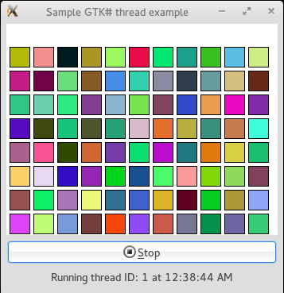
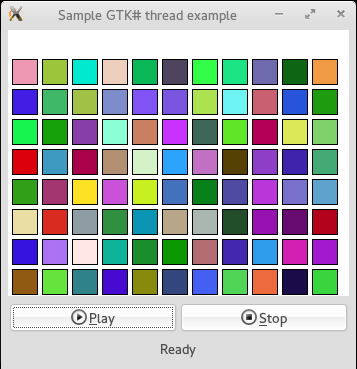
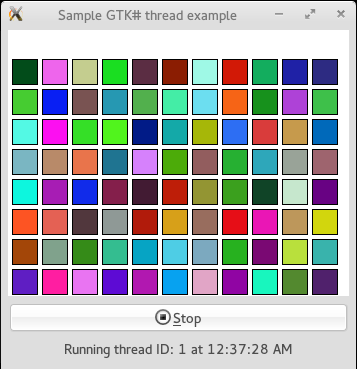
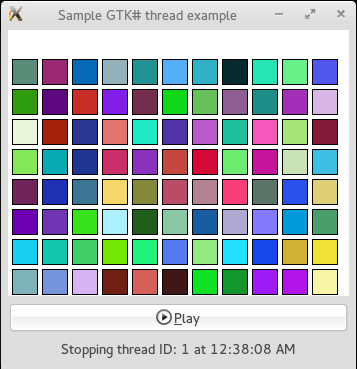

# Conceptos básicos de Threads con GTK#
		

			Históricamente el soporte para las operaciones en paralelo u operaciones concurrentes  en los lenguajes de programación no era común, la mayoría de lenguajes de programación proporcionaban dicho soporte como primitivas del sistema operativo que eran muy difíciles de programar y de mantener.
			

			
Fue hasta las décadas de los 70’s y 80’s del siglo XX que el departamento de defensa de los Estados Unidos construyo  el lenguaje de programación Ada que entre sus capacidades permite a los programadores especificar la programación en paralelo.

			
Una de las técnicas mas populares para la programación concurrente son los hilos (Threads) esta técnica se basa en el principio de la multi-programación propia de los sistemas operativos modernos.

			<h3>¿Qué es un Thread?</h3>
			
Un <b>thread</b> es la unidad básica de ejecución de un programa. En otras palabras, es la unidad más pequeña de ejecución para la cual un procesador reserva tiempo de procesador.  Es otra forma de que varias actividades se ejecuten al mismo tiempo con el objetivo de paralelizar el código e incrementar el rendimiento de un programa, por eso a los threads se les conoce como procesos livianos (lightweight processes), ya que estos corren en paralelo como si fueran procesos aunque todos se  ejecutan dentro de un mismo proceso que comparten recursos críticos tales como la memoria y el CPU.
			Un thread se compone de:
			

			<ul>
			<li>Un Thread ID  similar al Process ID.</li>
			<li>Un contador de programa.</li>
			<li>Un conjunto de registros.</li>
			<li>Una pila.</li>
			</ul>
			
A diferencia de un proceso los hilos comparten recursos como la sección de datos, la sección de código, los descriptores de archivo o las señales entre otras.

			<h3>Beneficios de la programación multithread</h3>
			<ul>
			<li>
El Multithreading (multihilado) permite a un proceso ejecutar múltiples tareas en paralelo. A cada tarea se le otorga su propio hilo de control, lo que ofrece los siguientes beneficios:
</li>
			<li>
<b>Rendimiento:</b> Porque todos los Threads se ejecutan dentro de un mismo proceso, el proceso no desperdicia recursos en hacer una copia de él mismo.  Los costos de copiar procesos fork y de ejecutar threads varían según el sistema operativo, aun así los threads son menos consumidores de recursos.
</li>
			<li>
<b>Simplicidad:</b> Los hilos son mucho más sencillos de programar  y de mantener que los procesos.</li>
			<li>
<b>Compartir la memoria global:</b> Como los hilos se ejecutan en un mismo proceso, cada hilo comparte el mismo espacio de direcciones de la memoria global del proceso.
</li>
			<li>
<b>Portabilidad:</b> Definitivamente los hilos son más portables que los procesos fork u otros mecanismos de programación concurrente.</li>
			<li>
<b>Capacidad de respuesta:</b> Es posible que un hilo se mantenga haciendo una actividad, por ejemplo de descarga de un archivo mientras que otro puede continuar con una actividad de E/S, aquí se puede programar un esquema basado en el bloqueo de un hilo a nivel individual. 
</li>
			</ul>
			<h3>Estados de un Thread, su ciclo vital</h3>
			
Todo hilo debe cumplir con un ciclo de vida, este ciclo de vida comienza con un <b>Thread</b> en el estado <b>Unstarted</b> (inactivo) que es cuando se inicia, el hilo permanecerá en ese estado hasta que se invoque su método <b>Start</b> (Inicia) y así pasar al estado <b>Running</b> (en ejecución) que es cuando el sistema operativo le asigna un procesador, cuando esta en ejecución el hilo ejecuta todas las actividades que están en su delegado ThreadStart hasta terminarlas, una vez terminadas estas actividades pasa al estado <b>Stopped</b> (detenido) ya en este estado termina su ciclo, aunque un hilo puede pasar a este estado sin terminar sus actividades si se invoca su método <b>Abort</b> (abortar).

			
Otros estados para un hilo son:
			<ol> 
			<li><b>Blocked</b> (Bloqueado) cuando el hilo tiene problemas en operaciones de E/S en donde necesita esperar por un recurso disponible.</li> 
			<li><b>WaitSleepJoin</b> cuando se le pide al hilo que no se ejecute un determinado tiempo.</li> 
			<li><b>Suspend</b> en este estado el hilo se interrumpe hasta que alguien invoque a su método Resume para regresar a la ejecución; en estos estados los hilos no pueden utilizar un procesador así se encuentre uno disponible.

			</ol>
			
Como nota adicional los métodos <b>Suspend</b> y <b>Resume</b> se encuentran obsoletos por lo que esta funcionalidad se implementa con la clase <b>Monitor</b>.

			
Para demostrar los conceptos básicos como la creación, el arranque y paro de un <b>Thread</b> he escrito el siguiente código como un ejemplo de como se escribe la creación de uno y la invocación de sus métodos <b>Start()</b> y <b>Abort()</b> respectivamente.

			
El siguiente programa es una sencilla animación en GTK# que dibuja rectángulos con un color diferente cada determinado tiempo utilizando las clases de dibujo de los ensamblados System.Drawing y gtk-dotnet. Este programa tiene dos botones: <i>play</i> y <i>stop</i>. El botón play inicia la animación en tanto que el botón stop detiene la animación.

<b>Fig 1 Programa GTK# de una animación con un Thread.</b>

 

El código fuente de este programa GTK# se divide en 3 clases:
<ul>
<li>1-. La clase program que es la clase inicial del programa que tiene al método Main(string[] args)</li>
<li>2-. La clase MainWindow que contiene la interfaz gráfica del programa aquí se crea el Thread y se controla su comportamiento por medio de los botones.</li>
<li>3-. La clase ColorBoxesCanvas que se encarga de dibujar las figuras de la animación.</li>
</ul>
 

		   
Una vez compilada la solución la ejecutamos como se verá como en la siguiente imagen:

		   
<b>Fig 3 El programa al iniciar de su ejecución.</b>
 
		   

		   
El programa muestra dos botones: play y stop, al oprimir el botón play se ejecuta el método <b>Run()</b>

Dentro de este método se crea un objeto <b>Thread</b> llamado worker al que se le pasa el delegado <i>canvas.Repaint</i> como argumento al constructor del objeto. Este delegado especifica la acción que realizará el subproceso durante su ciclo de vida, para este ejemplo el delegado es un método void  que no recibe argumentos. Aquí el hilo permanece en estado <b>Unstarted</b> hasta que se llama a su método <b>Start()</b>, ejecutando este método el hilo pasa al estado <b>Running</b> y devuelve el control del programa al proceso que invoco al método <b>Start()</b>.

		   
<b>Fig 4 El programa al presionar el botón play y llamar al método Start().</b>
 
		   

 
		   
Una vez en estado <b>running</b> el <b>Thread</b> puede pasar al estado <b>Stopped</b> o <b>Aborted</b> cuando termina la ejecución del delegado <b>ThreadStart</b>, esto indica que el subproceso terminado la tarea.
		   Un hilo en ejecución puede forzar entrar al estado <b>Stopped</b> cuando se invoca al método <b>Abort()</b>, después de invocar este método el subproceso se detiene.

		   
<b>Fig 5 El programa al presionar el botón stop y llamar al método Abort()</b>
 
		   

